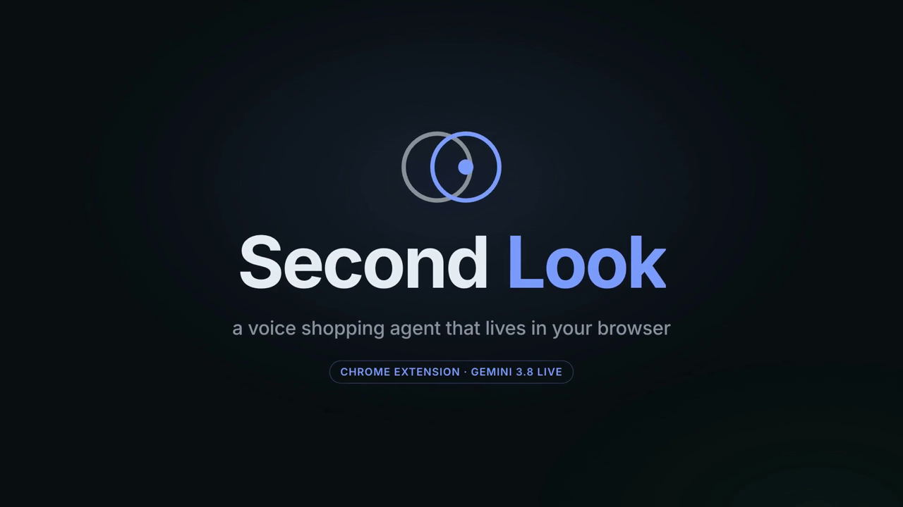
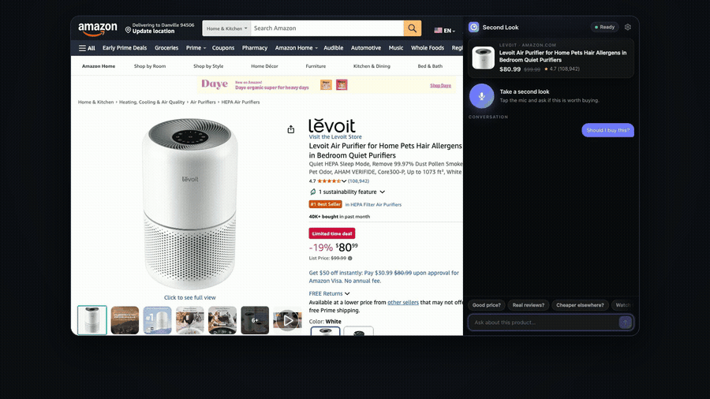
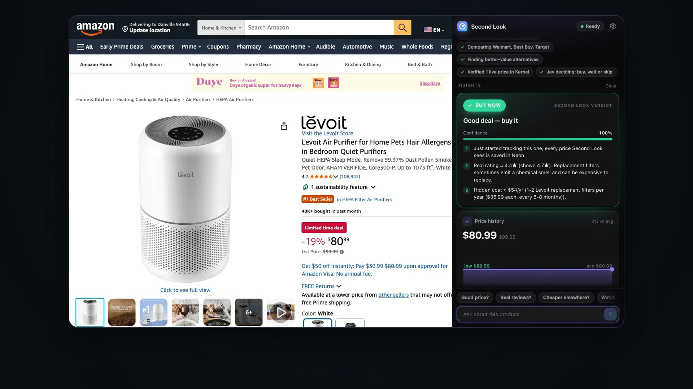
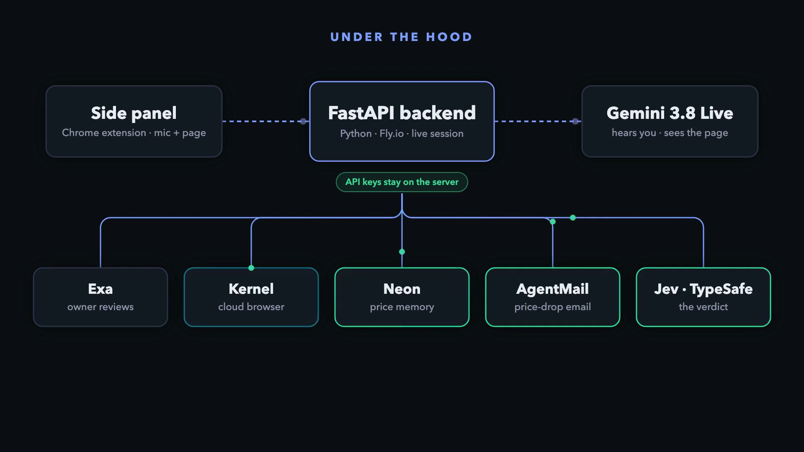

<p align="center">
  
</p>

<h3 align="center">Before you buy, take a second look.</h3>
<p align="center">A voice shopping agent that lives in your browser's side panel. Ask it out loud whether the thing on your screen is worth it; it checks real reviews, price history and other stores in the background while it talks with you, then gives you one honest verdict.</p>

<p align="center">
  <a href="docs/second_look_demo.mp4"><b>▶ Watch the demo (1:48)</b></a> ·
  <a href="#how-it-works">How it works</a> ·
  <a href="#run-it">Run it</a> ·
  Built at <a href="https://build-personal-agents.com/">Build Personal Agents Hack</a>, SF, Oct 4 2026
</p>

<p align="center"></p>

---

## Why

Product pages are built to rush you. "−35%" off a price nobody ever paid, a 4.7★ average inflated by free-product
reviews, and the same item $10 cheaper one tab away. Second Look is a friend who sits beside you while you shop and
does the homework you don't have time for, out loud, in the moment.

## What it does

| | |
|---|---|
| 🎙️ **Talk to it** | Gemini 3.8 Live hears you and **sees the page** (1 fps tab frames + structured product data from the page). |
| ⭐ **Real reviews** | Exa pulls Reddit and expert reviews; the shown rating is re-scored into a **real rating**, with the share of incentivized reviews. |
| 📈 **Price memory** | Every price it sees is saved in **Neon**. A "was $X" discount is only called fake once there's 30+ days of history proving it. |
| 🏬 **Other stores, live** | Exa live-crawls Walmart, Best Buy and Target; **Kernel** opens each store in a cloud browser to read the price a shopper actually sees (in-stock aware). |
| 🔄 **Alternatives + true cost** | Better-value picks and the hidden yearly cost (filters, ink, refills). |
| ⚖️ **One verdict** | **Jev (TypeSafe System One)** turns all the signals into `BUY_NOW / WAIT / SKIP / BUY_ALTERNATIVE` with calibrated confidence, in ~1 s. |
| 🔔 **Keeps working** | "Watch it under $75" → a price watch; Second Look has its own **AgentMail** inbox for alerts, receipts and price-adjustment emails. |

<p align="center"></p>

## How it works

<p align="center"></p>

```
Chrome side panel (MV3, vanilla JS)          FastAPI backend (Python)                       
  mic 16 kHz PCM ─┐                          ┌─ Gemini 3.8 Live session (audio in/out,      
  tab frames 1fps ├── WebSocket /ws ────────►│    vision, NON_BLOCKING tool calls)          
  product data  ──┘   cards · audio · chips ◄┤                                              
                                             ├─ research_product ──┬─ reviews   (Exa + Gemini Flash)
                                             │   (parallel fan-out)├─ price     (Neon history)
                                             │                     ├─ stores    (Exa live crawl → Kernel live verify, background)
                                             │                     └─ alternatives + lifetime cost (Exa)
                                             │                         └─► Jev verdict
                                             ├─ watch_price / send_email ─ AgentMail inbox
                                             └─ Neon Postgres: products, price_history, watchlist, purchases, emails, memories
```

**No lag by design**

- Tools are declared `NON_BLOCKING`, so Gemini keeps the conversation going while research runs. An interim tool
  response (`will_continue`) makes it say "On it — checking real reviews and other stores" within ~4 s.
- The four research tracks run concurrently and each card streams to the panel the moment it lands.
- The verdict never waits on a slow store page: Kernel's live verification runs in the background and updates the
  stores card when it finishes.
- Every Flash call is capped at 12 s and falls back across Gemini Flash versions on 503s.
- API keys never ship in the extension; the backend holds the live session.

## Run it

**Backend**

```bash
cd backend
python3 -m venv .venv && . .venv/bin/activate && pip install -r requirements.txt
cp .env.example .env   # fill in keys
uvicorn app.main:app --port 8000
```

| Variable | What for |
|---|---|
| `GEMINI_API_KEY` | Gemini 3.8 Live (voice + vision) and Gemini Flash (structured extraction) |
| `DATABASE_URL` | Neon Postgres (schema is created on startup) |
| `EXA_API_KEY` | reviews, store listings, alternatives |
| `KERNEL_API_KEY` | live store prices in cloud browsers (optional) |
| `TYPESAFE_API_KEY` | Jev verdicts |
| `AGENTMAIL_API_KEY`, `AGENTMAIL_INBOX` | the agent's inbox (optional) |

Deploy: `cd backend && fly launch --copy-config && fly secrets import < .env && fly deploy`.

**Extension**

1. `chrome://extensions` → Developer mode → **Load unpacked** → `extension/`
2. Open any Amazon product, click the Second Look icon, tap the mic (first time: grant mic access in the tab that opens).
3. Settings (⚙) → backend URL if not `ws://localhost:8000/ws`.

**Smoke test without a browser:** `python backend/tests/ws_smoke.py "Should I buy this?"`

## The demo film

`video/` contains the film pipeline: narration, motion graphics (Hyperframes + Motion Canvas), music and assembly
are produced with [Cutroom](https://github.com/KaushikSiva/cutroom); `video/rec/record.mjs` records the real extension
against the live backend with Playwright (CDP screencast) and `compose.py` lays the agent's own voice onto the
timeline. No generated video: every product shot is a real session on a real Amazon page.

## Honesty notes

- Prices, store reads, reviews and verdicts in the demo are real, captured live on Oct 4 2026.
- `backend/seed.py` can seed price history for local testing; seeded rows are tagged and the panel labels them
  "demo data".

## Built with

Gemini 3.8 Live · Exa · Kernel · Neon · AgentMail · Jev by TypeSafe · Fly.io · FastAPI · Chrome MV3

MIT License
